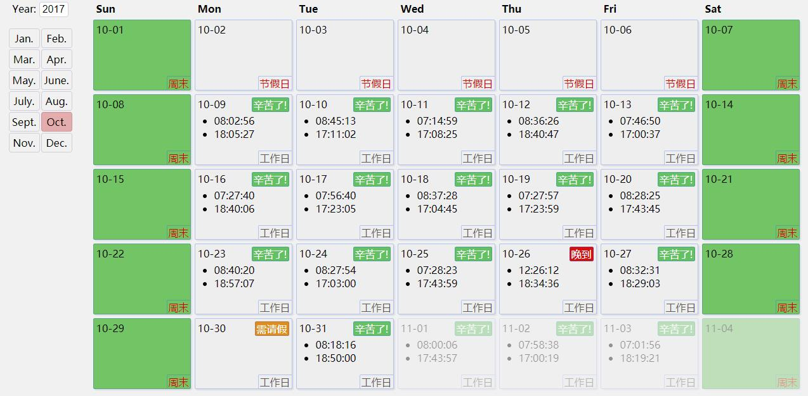

# Time Card (Problem3)

## Demo
[~~https://challenge.magiclocker.cn/~~](https://challenge.magiclocker.cn/)  Or
[~~http://120.78.209.107/~~](http://120.78.209.107/)

## Snapshot


## Getting Started
### Install Global Dependencies

```bash
$ npm install -g gulp
```

### Build & Development
```bash
# install local dependencies
$ npm install

# build package to ./dist
$ gulp

# start the dev server and browser to http://localhost:3000
$ gulp watch
```
